# Architecture

## One product, one repository

This repository is **Offset Irtiqa** (SAMA CSF) and nothing else: the
application and the framework pack it is built with. There is no shared engine
and nothing is fetched from another repository.

```
pnpm build     →  packs/ascend/*  compiled into the web bundle
                  and copied into the image at /app/pack
```

The diagrams in this document are written in Mermaid. GitHub draws them as
pictures; in an editor without Mermaid support they read as text.

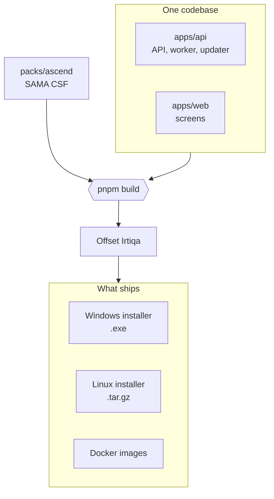

A pack is content, not code: `pack.json` (names and which features are on),
`controls.json`, `themes.json`, `guide.json` (the explanation on each control),
and where the product has them `journey.json` (Get ready) and `samples.json`
(the sample library). The `features` flags in `pack.json` decide which screens
appear, so changing what a screen says is a change to the pack, not to the code.

| Product | Pack | Screens of its own |
|---|---|---|
| Offset Irtiqa | `ascend` | Maturity scoring, Get ready |

## Runtime

Three supported tracks. All run identical code against an identical SQLite
schema — one dialect, one migration history, no track-only bugs. And all three
run the same two processes: the API, and the worker that sends reminders and
takes backups. A track that starts only the API looks healthy and chases nobody.

What every install looks like, whichever track:

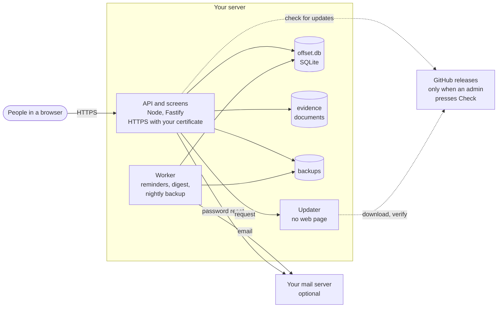

### Track A — Docker Compose

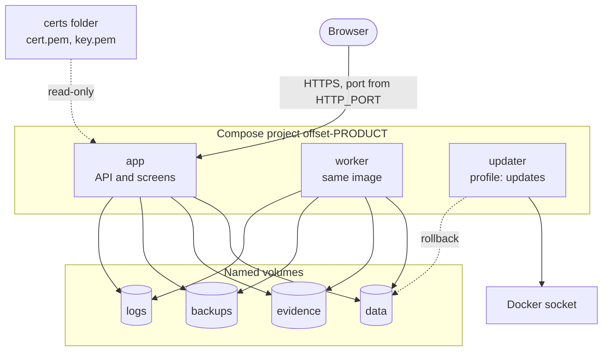

Node terminates TLS itself when `TLS_CERT_FILE` and `TLS_KEY_FILE` are set;
there is no proxy in the default stack. Each product is its own Compose
project, so two products on one host never share a volume.

### Track B — Windows native (evaluation, small/medium)

An Inno Setup `.exe` bundles pinned Node 24. A launcher starts the API and the
worker as one process tree, optionally at boot as a scheduled task. Node
terminates TLS itself; there is no proxy. No Docker, no database service, no
prerequisites.

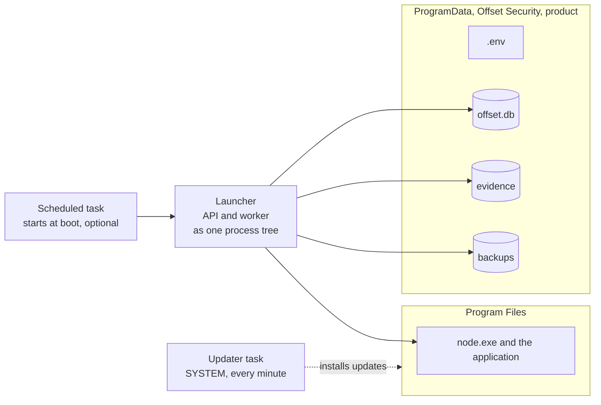

### Track C — Linux native

A tarball with its own Node, installed as two systemd units,
`offset-ascend` and `offset-ascend-worker`, the second `PartOf` the first.
Application in `/opt`, data in `/var/lib`, a system account with no shell.

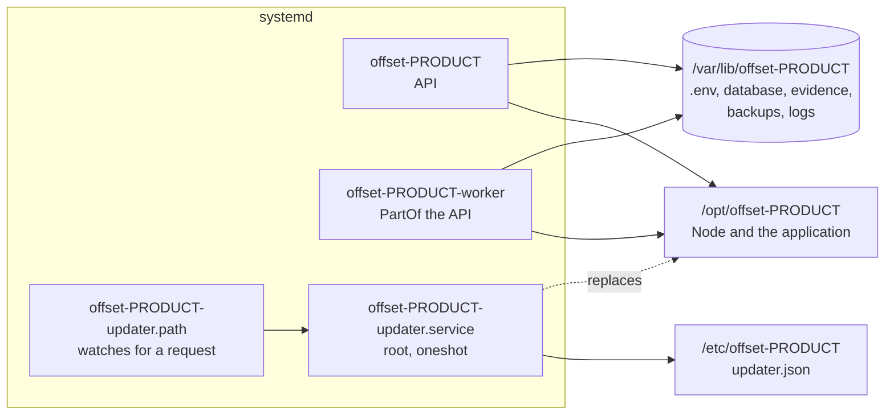

The native modules are compiled on RHEL 8 (UBI 8 with GCC Toolset 13), not
downloaded: npm's prebuilt SQLite driver needs glibc 2.29 and RHEL 8 has 2.28.
The floor is therefore glibc 2.28, x86_64, systemd. See `deploy/linux/build.sh`.

## Updates

```
Settings → Updates (admin)          updater (privileged, no web page)
  check: fetch + verify manifest      reads request (untrusted)
  apply: backup, write request  ──▶   re-fetches + verifies manifest
                                      downloads, checks SHA-256 / digest
                         status  ◀──  installs, health-checks, rolls back
```

The application and the updater share `apps/api/src/update/release.ts`
(signature, manifest shape, versions) and `update/files.ts` (the handoff), and
neither file imports config: an updater must never read the application's
settings, which on Linux the application can write.

| Track | Updater | Request folder | Status folder | Trust settings |
|---|---|---|---|---|
| Docker | `updater` container, Docker socket | volume, read-only to it | volume, read-only to the app | its own environment |
| Linux | `offset-<p>-updater.service`, root, oneshot | `/var/lib/offset-<p>/updates/request` | `/var/lib/offset-<p>/update-status` (root:app 0750) | `/etc/offset-<p>/updater.json` |
| Windows | `<Product> Updater` task, SYSTEM, every minute | `ProgramData\…\<Product>\updates\request` | `ProgramData\…\<Product> updater\status` (users read) | `updater.json` beside `node.exe` |

One update, start to finish:

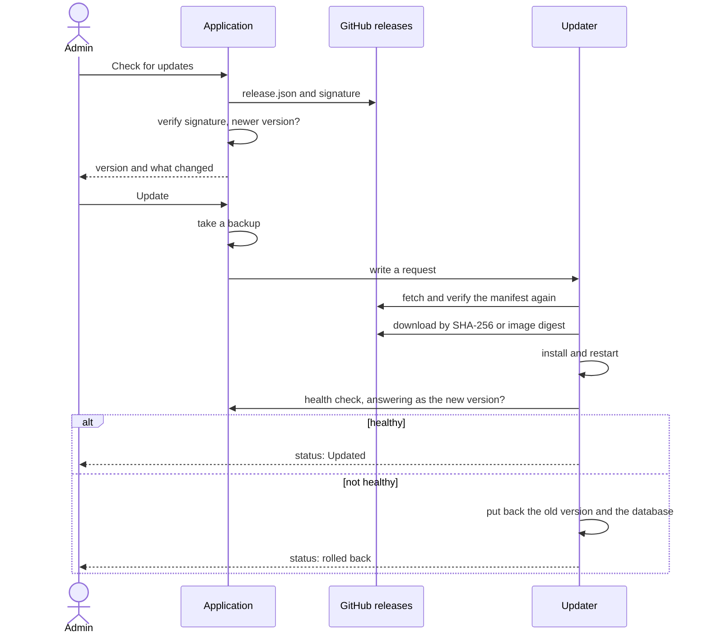

Publishing is one tag. GitHub Actions builds every package, signs one manifest
naming them all, and publishes it to this repository's own releases page:

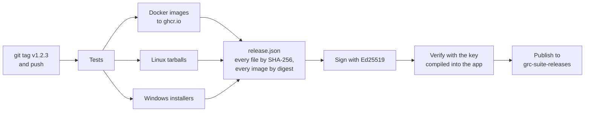

Signed manifest format, key rotation and the release workflow:
[releasing.md](releasing.md).

## Backups and restore

A backup is one SQLite file holding the database and every evidence document,
each stored with its SHA-256. The worker takes one nightly, an administrator can
take one from the Backups screen, and `dist/db/backup.js` takes the same from
the command line. Code: `apps/api/src/backup/service.ts`.

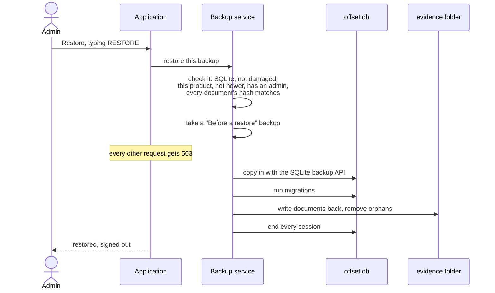

A file that fails any check is refused before anything changes.

## Why SQLite

The largest expected deployment is under 50 users, and the workload is nearly
all reads. An embedded database removes a service to install, tune, patch and
back up on a machine we cannot see, and makes backup and restore a file copy.
The ceiling is concurrent writers, not users. See
[ADR 0002](adr/0002-sqlite-not-postgres.md), which supersedes ADR 0001.

## Data model

Most of the model is framework-independent and gets real columns.
Framework-specific fields live in a JSON `attrs` column:

| Product | What goes in `attrs` |
| --- | --- |
| Ascend | `priority` only — its two extra fields are real columns, see below |

### Maturity is a column, not an attr

`controls.maturity` and `controls.target_maturity` are nullable integer columns
rather than entries in `attrs`, because they are aggregated on every dashboard
load — averaged, counted per level, compared against a target. That is index and
`sum()` work, and `json_extract` in a `group by` is the wrong tool for it.

Null means **nobody has assessed this yet**, which is not the same as zero. Every
average excludes unscored rows rather than counting them as nought; treating "not
looked at" as "does not exist" makes the first week of an assessment look like a
catastrophe and makes the number move for the wrong reason.

The range is validated in the API against `MATURITY_MIN` / `MATURITY_MAX` rather
than by a `CHECK` constraint, so a pack that one day wants a different scale is a
config change instead of a migration.

The fields that get filtered on have expression indexes over
`json_extract(attrs, '$.field')`, so those queries stay fast.

Ids are UUID text generated by the application, and timestamps are ISO-8601 text
in UTC — both sort correctly as strings, which is what SQLite compares.

The main tables and how they connect. Almost everything links to `controls`,
through a link table named on each line. `asset_risks`, `incident_risks` and
`control_tests` are left out for space.

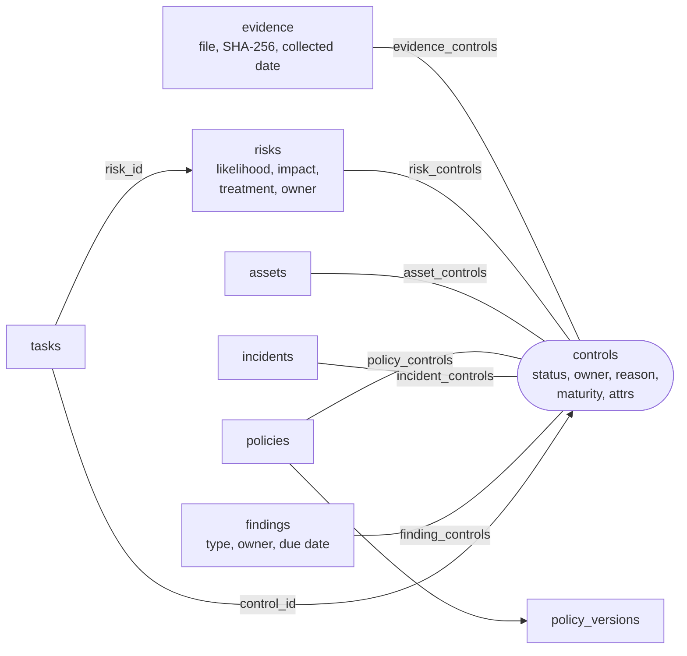

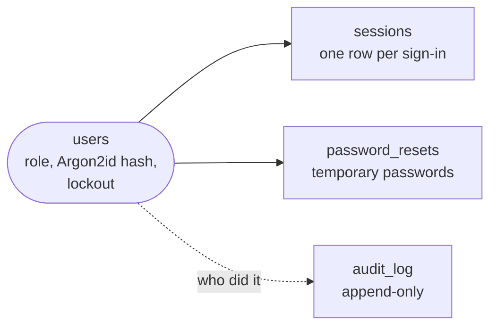

Standing on their own: `programme` (one row: scope, risk method, programme
attrs), `settings` (mail, branding, digest), `jobs` (the worker's queue),
`trend` (the daily readiness snapshot) and `journey_tasks` (Get ready steps
ticked by hand, with the name of whoever ticked them).

## Get ready

The plan is content in the pack; the engine is shared.

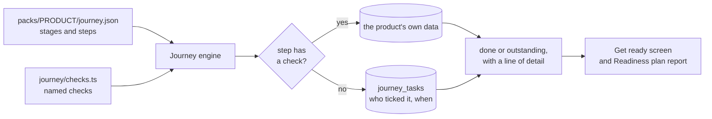

A test fails the build if a pack names a check that does not exist, or sends
somebody to a screen its product does not show.

## Request lifecycle

1. Node terminates TLS itself when a certificate is configured. A reverse proxy
   in front is optional, not part of the default install.
2. `preHandler` refuses everything with 503 while a restore is running, then
   resolves the session cookie into `request.user` (or leaves it unset). A
   session signed in with a temporary password can reach only the page that
   sets a new one.
3. The route's RBAC guard runs: it checks the role and, for any state-changing
   method, verifies the double-submit CSRF token.
4. The service layer calls `assertCanWrite()` again — a route wired up without a
   guard still cannot mutate data.
5. Every mutation writes an append-only `audit_log` row.

## Authentication

- Local accounts: Argon2id (19 MiB, 2 passes), lockout after 5 failures for 15
  minutes, transparent re-hash when parameters are raised.
- Sessions are server-side rows in `sessions`, referenced by an HMAC-sealed
  cookie. Sliding expiry, throttled to one write a minute.
- Forgot password, for administrators: a temporary password by email, single
  use, 30 minutes, which opens nothing but the page to choose a new password.
- SSO was dropped on 2026-09-10; see the roadmap.

## Background jobs

A `jobs` table plus a polling worker — no Redis, no broker, nothing extra to
operate on a customer site. Jobs: daily readiness snapshot, daily digest email,
due-date reminders, nightly backup with pruning, WAL checkpoint, and session and
job-log purges.

## Secrets

`SESSION_SECRET` signs session cookies. `FIELD_ENC_KEY` encrypts secret columns
(the SMTP password) — AES-256-GCM in the application, since
SQLite has no `pgcrypto`. Both are 32-byte hex values
and the app refuses to start in production without them.

## Open decisions

See `docs/dev/adr/`.
