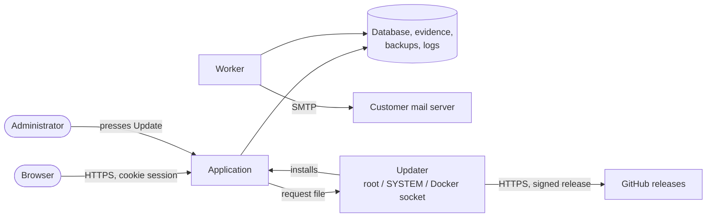

# Threat model

What could go wrong with an Offset install, who could make it go wrong, what
stops them today, and what does not yet. For the people who build and release
the product. The customer-facing version is [the security overview](../security-overview.md).

Reviewed against the code on 2026-09-21. Update it when a trust boundary,
a role or the update path changes.

## What we protect

| Asset | Why it matters |
|---|---|
| Compliance records | Risks, findings, gaps and incidents are a map of the customer's weak spots |
| Evidence files | Configuration exports, policies and reports. Often confidential |
| Credentials | Password hashes, sessions, the mail server password |
| The audit trail | The record of who did what. Worth nothing if it can be quietly changed |
| Backups | Hold all of the above in one file |
| The update channel | Whoever can publish an update can run code on every install that presses Update |
| The server | The product runs code on it and, through the updater, can install software |

## Who might attack

| Actor | Starts with |
|---|---|
| Someone on the customer's network | Network access to the port, no account |
| A signed-in user | An account with a low role, wanting more |
| Someone with a stolen backup or log | A file, taken from wherever it was copied |
| Someone with access to the server | The files on disk |
| Someone who controls the release channel | Our GitHub account or the signing key |
| A compromised dependency | Code running inside the product |

## Trust boundaries

1. **Browser to application.** Everything from the browser is untrusted.
2. **Application to disk.** The application trusts its own files. Anyone who
   can write them is past every control below.
3. **Application to updater.** The application can only drop a request file.
   The updater, which has the rights, acts only on a release it has verified.
4. **Updater to the internet.** GitHub is untrusted. Only the signature is
   trusted.

## Threats, and what stops them

| # | Threat | What stops it | Where |
|---|---|---|---|
| 1 | Guessing a password | Argon2id hashes; 12-character minimum; lockout after 5 failures for 15 minutes; failures logged with IP | `auth/password.ts`, `routes/auth.ts` |
| 1a | One address guessing at every account, or locking them all out | 20 failed sign-ins from one address in 15 minutes block it, checked before any account is read, so it can neither guess nor push an account into lockout. Only failures count, so an office behind one address is not affected | `auth/address-limit.ts`, `test/audit.e2e.test.ts` |
| 1b | Choosing the address the trail and the limits see | X-Forwarded-For is believed only from loopback or the proxies named in `TRUST_PROXY`. It used to be believed from anyone, so any caller could write any address into the audit trail and dodge an address limit | `app.ts`, `config.ts` |
| 2 | Stealing a session | Random ID, HMAC-signed cookie; HttpOnly, Secure on HTTPS, SameSite=Lax; server-side sessions; 12-hour idle expiry | `auth/session.ts` |
| 3 | Reading traffic on the network | Refuses to serve a network address without TLS unless deliberately overridden; HSTS in production | `server.ts`, `app.ts` |
| 4 | Cross-site request forgery | Double-submit token checked in constant time on every write that needs a role, plus SameSite=Lax | `auth/rbac.ts`, `auth/session.ts` |
| 5 | Cross-site scripting | Preact escapes output; CSP allows only the product's own scripts; no inline scripts | `app.ts` (helmet) |
| 6 | Clickjacking | `frame-ancestors 'none'` | `app.ts` |
| 7 | SQL injection | Zod validation of every body and query; user input only as query parameters. Table and column names come from code, never from a request | `routes/*` |
| 8 | A low role changing data | Role checked on the server for every route; auditors and read-only users rejected on every write | `auth/rbac.ts`, `test/rbac.test.ts` |
| 9 | A malicious upload | Size limit; one file per request; always served as an attachment with `nosniff`, never rendered | `routes/evidence.ts` |
| 10 | Path traversal through backup names | Backup names must match a strict pattern; nothing else in the folder is listed, served or restored | `backup/service.ts` |
| 11 | Abusing Forgot password | Same answer for every request; 5 per 15 minutes per address; temporary password works once, for 30 minutes, and only to set a new one; the old password keeps working | `routes/auth.ts`, `auth/temporary.ts` |
| 12 | Taking over a new install | The first-administrator route closes once an administrator exists | `routes/auth.ts` |
| 13 | A malicious update | Ed25519 signature over the manifest against keys compiled into the product; SHA-256 per file; image digests; HTTPS only; a backup before installing and automatic rollback | `update/release.ts`, `updater/*` |
| 14 | The application misusing the updater | The application can only write a request file; the updater verifies the release itself before acting | `updater/common.ts` |
| 15 | Secrets in logs | Passwords, hashes, cookies, secrets and tokens redacted before writing | `lib/logging.ts` |
| 16 | The mail password leaking | AES-256-GCM with a key generated per install; never returned by the API | `lib/secrets.ts`, `routes/settings.ts` |
| 17 | The server's private key leaking | Only an administrator can upload one. Kept in one file beside the database (mode 600 on Linux and Docker; on Windows, under the same folder permissions as the settings file and its secrets), and never returned by the API, written to the audit trail, or put in a backup. A `.pfx` password is AES-256-GCM encrypted like the mail password | `tls/certificate.ts`, `routes/certificate.ts` |
| 18 | Swapping in the wrong certificate | The key must belong to the certificate and the certificate must be in date, or it is refused. A different name, self-signed or close to expiry is shown to the administrator before it replaces the one in use. Every upload and removal is in the audit trail | `tls/certificate.ts`, `test/certificate.e2e.test.ts` |
| 17 | A disabled user carrying on | Disabling, or an administrator setting a password, deletes all of that user's sessions at once | `routes/users.ts` |
| 18 | Secrets or vulnerable dependencies in the code | CI runs gitleaks and Trivy (vulnerabilities, secrets, misconfiguration), failing on high and critical; runtime dependencies pinned to the tested versions | `.github/workflows/ci.yml`, `deploy/runtime-manifest.mjs` |
| 19 | A process escaping its lane | Linux: own user and systemd sandboxing. Windows: LocalService. Docker: non-root, published on 127.0.0.1 by default | `deploy/*` |
| 20 | Hiding activity, or the trail leaking | The trail is append-only and has no route that edits or deletes it. It is shown to administrators and auditors only; keys that look like passwords, keys or tokens are hidden; a downloaded cell that starts like a formula is made text; each download is itself recorded | `routes/audit.ts`, `audit/audit.ts` |

## Known gaps

In rough order of how much they matter. Each one is also stated honestly in
the security overview, the questionnaire or both.

| # | Gap | Risk | What would close it |
|---|---|---|---|
| G1 | **No multi-factor authentication** | A phished or reused password is enough to sign in | TOTP. The `users.totp_secret` column is already there |
| G4 | **The audit trail is not tamper-evident** | Anyone who can write the database file can change history without trace | Chain each entry to the previous one with a hash, and check the chain in a report |
| G5 | **Nothing is encrypted at rest by the product** | A copied disk or backup gives everything | Document disk encryption (done); optionally encrypt backups with a key the customer holds |
| G6 | **The updater holds high rights** | root, SYSTEM, or the Docker socket, which is root on the host | Already optional and limited to verified releases. Keep it that way; never let it act on anything but a signed manifest |
| G7 | **One signing key** | If it leaks, a malicious update would be accepted by every install whose administrator presses Update | The key lives only in the release workflow's secrets. Rotation is built in: ship a build trusting both keys, then switch |
| G8 | **No single sign-on** | Accounts are managed separately from the customer's directory, so leavers must be disabled by hand | OIDC or SAML. The `users.auth_source` column is already there |
| G9 | **Uploads are not scanned** | A user can upload malware that a colleague later downloads and opens | Leave to the customer's endpoint protection, or add an optional ClamAV hook |
| G10 | **CSP allows inline styles** | Low: inline styles cannot run code | Move the remaining inline styles into the stylesheet |
| G11 | **No independent penetration test** | Mistakes nobody here thought to look for | Commission one before the first paid customer |

Closed since this was first written: **G2**, the per-address limit on sign-in
(threat 1a), and **G3**, the audit trail screen (threat 20). The numbers are
kept so older references still point somewhere.

## When to revisit this

- A new role, or a change to what a role may do.
- A new way in: API keys, SSO, a new port, a new integration.
- A change to the updater or the release pipeline.
- Anything that sends data off the server.
